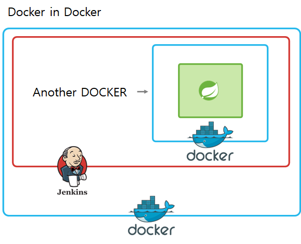
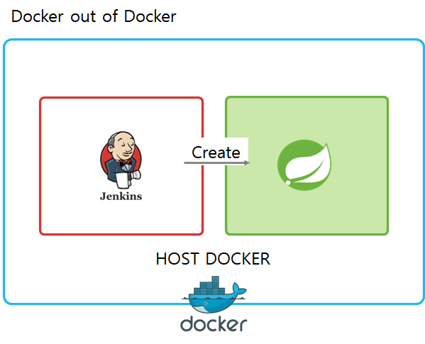
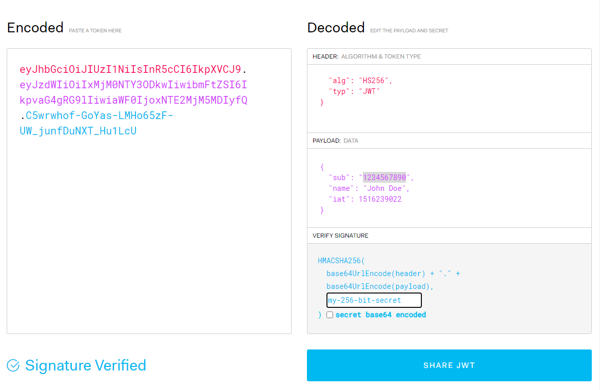

# 프로젝트 '한잔'

RESTful 백엔드 시스템 개발 및 CI/CD 개발환경 구축

<div align=left><h1>📚 STACKS</h1></div>

<div align=left> 
   
  
  <br>
   
   
   
  
  <br>

   
   
   
  <br>

   
   
   
  <br>
</div>

### 프론트: Vue.js, android, ios 등 클라이언트 추가 예정

> RESTful APIs 설계로 다중 클라이언트를 지원하도록 설계

### 백엔드: SpringFramework, Java, JPA(ORM), MariaDB

> 도메인 주도 설계와 RESTful 목적에 부합하는 백엔드 구현

### 인프라: Ubuntu20.0.4(Linux), Docker, Jenkins, Slack

> Docker, Jenkins를 활용해 자동 빌드 및 무중단 배포, slack을 활용한 푸쉬알림

<br><br>

## 주요기능 변동 사항

- 2022.06.16 프로젝트 생성
- 2022.06.19 jenkins를 활용한 지속적 통합 환경 구축 완료
- 2022.06.23 master/develop 브랜치별 DB 할당(개발전용 DB 할당)
- 2022.06.24 JWT 방식의 인증 구현

<br><br>

## 리뷰

- jenkins(Docker 컨테이너로 실행)시 스프링 컨테이너 배포문제

  > 도커로 실행된 jenkins에서 스프링 서비스를 추가적인 도커 컨테이너로 실행하고자 할때 이중화 되는 문제(Docker in Docker)
  > DinD는 사용 가능한 구조긴 하지만 공식적으론 DinD보다 DooD방식을 권장하고 있음
  > DinD로 실행시 컨테이너가 절대적인 권한을 부여받는 등 보안상 문제가 방생함
  >
  >  > 
  >
  > **해결책: docker.sock 파일을 jenkins 컨테이너와 공유하여 jenkins컨테이너 에서 Host Docker 엔진을 사용할 수 있게 설계(Docker out of Docker)**

  <br>

- jenkins 와 github 연동중 민감정보 파일 관리

  > 공개된 git repo에 키, 비밀번호 등 파일을 업로드 하는것은 매우 위험한 행동이다.
  > 하지만 jenkins는 연결된 git repo에서 소스코드를 클론하여 빌드 동작을 수행한다.
  > 그래서 민감정보 파일을 형상관리에서 제외 시키면 jenkins는 제대로된 빌드를 수행할 수 없다.
  >
  > **해결책: 민감정보 파일을 jenkins 컨테이너에 생성하고 빌드가 트리거될때 파일을 주입시켜 빌드에 포함되도록 구현**

  <br>

- 지속적인 Reverse proxy 적용

  > 다른 docker-compose 단위로 구성된 nginx-proxy 컨테이너와 같은 networks로 구성  
  > [docker-compose](docker-compose.yml)
  >
  > ```
  >  networks:
  >    {외부네트워크}:
  >    external: true
  > ```
  >
  > **Spring 컨테이너의 배포와는 무관하게 nginx 프록시는 Spring 컨테이너를 항상 바라보도록 구현**

  <br>

- Lombok Builder 잘못 알고 사용시 NullPointerException

  > ```
  > @OneToMany(mappedBy = "member", fetch = FetchType.LAZY)
  > @Builder.Default // 설정 안할 시 Null이 기본값
  > private List<MemberGroup> memberGroups = new ArrayList<MemberGroup>();
  > ```
  >
  > **빌터패턴 사용시 기본값으로 null이 입력된다 이를 방지하기 위해  
  > @Builder.Default를 사용하여 기본값 명시**

  <br>

- JPA에서 양방향 관계 설정시 주인이 아닌 Entity에서 조작시 1차캐시 에러

  > 양방향 관계에서는 관계의 주인쪽에서 데이터를 조작해야 DB에 정상적으로 반영된다

  <br>

- REST 방식으로 로그인 구현

  > RESTful 서버는 캐시와 세션을 유지하지 않는 무상태성으로 설계되어야 한다  
  > 세션을 활용한 로그인 방식 => 토큰(JWT)을 사용한 인증 방식 구현

  <br>
  
- JWT 토큰의 구조

  > 
  > - Header - 토큰 타입, 알고리즘(HS256, RSA 주로 사용) 정보  
  > - Payload - 실제 사용될 정보(claim)를 담음 claim은 이름,값 쌍으로 이루어짐  
  > - Signiture - Header와 Payload는 단순한 Base64로 인코딩 되기 때문에 누구나 디코딩이 가능, Signiture 에서는 비밀키를 활용하여 암호화 시킴 (비밀키는 서버에서만 유지)
  
  <br>
    
- JWT 토큰의 한계점

  > - StateLess 특성상 사용자가 토큰을 탈취 당했을 시 서버에서 특정하여 만료시키기 어려움  
  > - 사용자의 접속정보를 확인하기 어렵다 (세션유지 X)  
  > - 내장된 정보량에 따른 토큰 길이(부하) 증가  
  > - 클라이언트 사이드에서도 높은 수준의 관리가 요구됨  
  >  
  > - ## 정리  
  >   JWT는 StateLess 서버 구축에 어쩌면 **가장 필수적이고  편리한 방법**이다.  
  하지만 **한번 생성된 토큰은 서버에서 제어가 불가능**하며, **토큰 저장을 클라이언트에 위임**한다.   
  또한 **Header, Payload**는 Base64로 인코딩되어 누구나 디코딩이 가능함으로 **민감한 정보를 담지 않도록** 주의 해야 한다
  
  <br>
     
- 회원가입시 이메일 인증

  > - 시나리오  
  > 회원가입요청 -> 이메일 중복검사 -> 회원가입(임시)-> EmailToken발급 및 전송 -> 이메일 확인(유저) -> 토큰 검증 -> 회원가입 완료

  <br>


  <br><br>
## ToDoList in Project
- 로그인 구현 시 파라미터 암호화
- CustomException + @RestControllerAdvice 공통예외 처리
- Vue.js 활용(SPA)  프론트엔드 구현
- CORS 문제 해결 @CrossOrigin
- 이메일 인증


